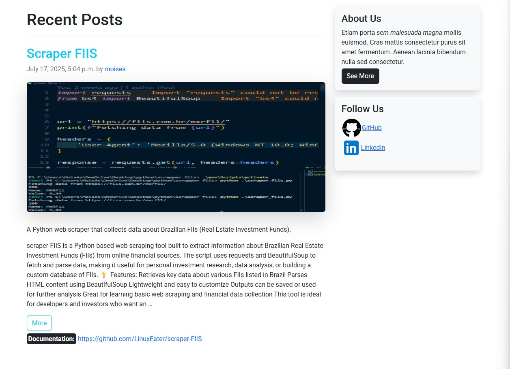

# Blog Projects Development

A comprehensive Django blog project featuring a custom admin panel, multiple page layouts, and category-based post filtering.

---

## English

### Overview

This project is a blog platform built with Django, featuring:

- A customized admin panel for easy content management.
- Multiple homepage layouts to showcase posts in different styles.
- Individual post pages with detailed views.
- Post filtering by category for better navigation.

### Screenshots

| Admin Panel          | Homepage 1           | Homepage 2           |
|----------------------|----------------------|----------------------|
|  |  |  |

| Single Post 1        | Single Post 2        | Posts by Category    |
|----------------------|----------------------|---------------------|
|  |  |  |

### Installation

1. Clone the repo:
   ```bash
   git clone https://github.com/LinuxEater/Blog-Projects-Development.git
   cd Blog-Projects-Development
   ```
2. Create a virtual environment and activate it:
   ```bash
   python -m venv venv
   source venv/bin/activate  # Linux/macOS
   venv\Scripts\activate     # Windows
   ```
3. Install dependencies:
   ```bash
   pip install -r requirements.txt
   ```
4. Apply migrations:
   ```bash
   python manage.py migrate
   ```
5. Run the development server:
   ```bash
   python manage.py runserver
   ```
6. Access the blog at `http://127.0.0.1:8000/`

### Features

- User-friendly admin panel
- Responsive design
- Multiple homepage layouts
- Post filtering by category
- Detailed single post views

---

## Português

### Visão Geral

Este projeto é uma plataforma de blog construída com Django, que inclui:

- Painel administrativo customizado para gerenciamento fácil de conteúdo.
- Vários layouts de página inicial para exibir posts de diferentes maneiras.
- Páginas individuais de post com visualização detalhada.
- Filtro de posts por categoria para facilitar a navegação.

### Capturas de Tela

| Painel Administrativo | Página Inicial 1     | Página Inicial 2     |
|-----------------------|---------------------|---------------------|
|  |  |  |

| Post Individual 1     | Post Individual 2    | Posts por Categoria  |
|-----------------------|---------------------|---------------------|
|  |  |  |

### Instalação

1. Clone o repositório:
   ```bash
   git clone https://github.com/LinuxEater/Blog-Projects-Development.git
   cd Blog-Projects-Development
   ```
2. Crie e ative um ambiente virtual:
   ```bash
   python -m venv venv
   source venv/bin/activate  # Linux/macOS
   venv\Scripts\activate     # Windows
   ```
3. Instale as dependências:
   ```bash
   pip install -r requirements.txt
   ```
4. Aplique as migrações:
   ```bash
   python manage.py migrate
   ```
5. Execute o servidor de desenvolvimento:
   ```bash
   python manage.py runserver
   ```
6. Acesse o blog em `http://127.0.0.1:8000/`

### Funcionalidades

- Painel administrativo amigável
- Design responsivo
- Vários layouts de página inicial
- Filtro de posts por categoria
- Visualização detalhada de posts individuais

---

Made with ❤️ by Moisés Souza
